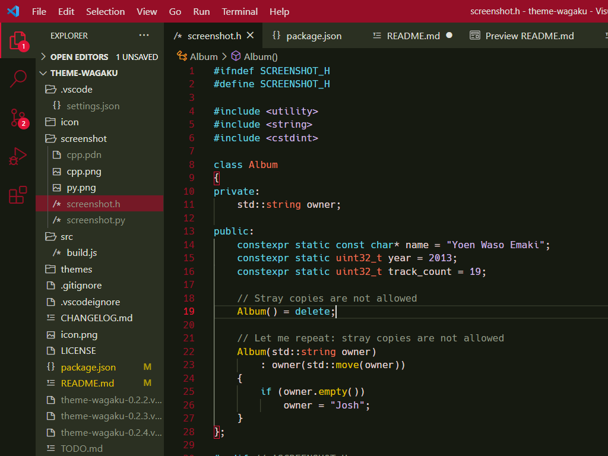
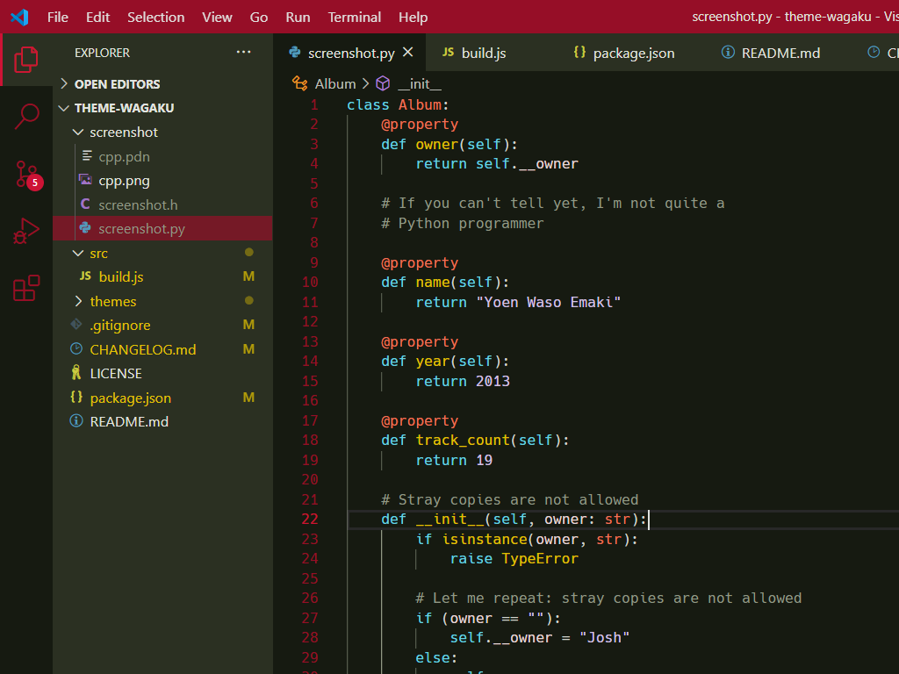

# Theme Wagaku

A minimally colorful theme. Inspired by the album art of Yoen Waso Emaki (妖艶和奏絵巻)

- [album official site](https://avex.jp/yoen/)
- [album art original artist (pixiv)](https://www.pixiv.net/users/708358)

Mainly for my own C/C++ programming.

## Screenshots

- Font: [Hack](https://sourcefoundry.org/hack/) 13px
- Platform: Windows 10 (125% display scaling)

#### C++

#### Python

## Features

- Your standard more-or-less neutral white text on black background
- No gazillion syntax colors, just 4
- Red as main accent color, low on blue

## Build

run `node ./build.js` (Node.js required)