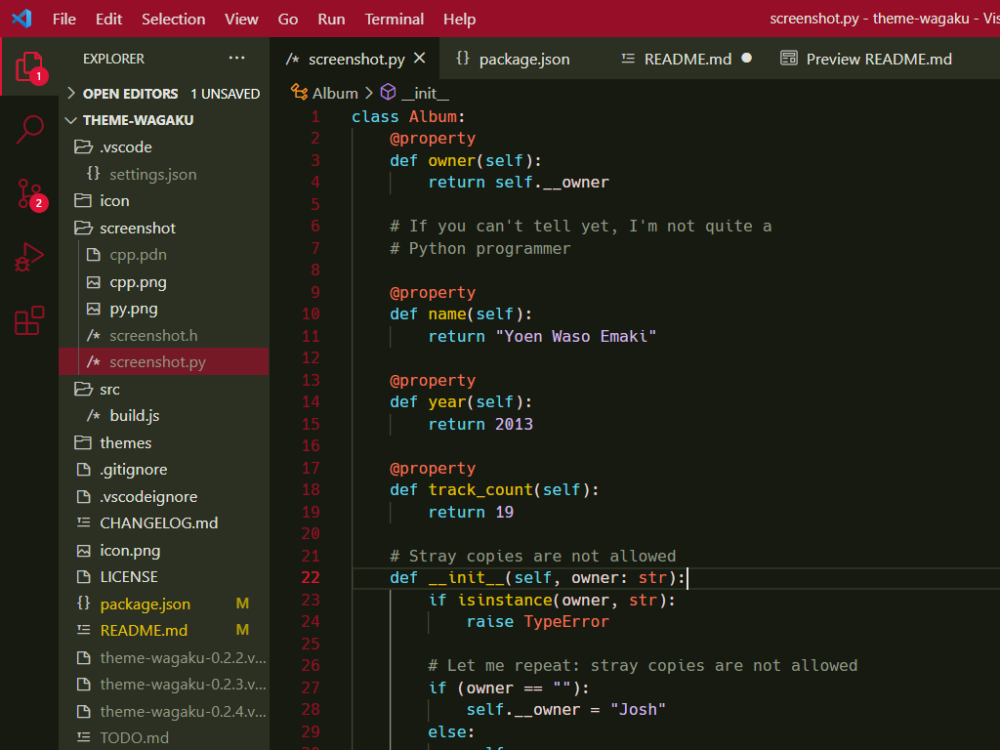

# Wagaku Theme

A minimally colorful theme. Inspired by the album art of Yoen Waso Emaki (妖艶和奏絵巻)

- [album official site](https://avex.jp/yoen/)
- [album art original artist (pixiv)](https://www.pixiv.net/users/708358)

## Screenshots

- Font: [Hack](https://sourcefoundry.org/hack/) 13px
- Platform: Windows 10 (125% display scaling)

#### C++

#### Python

## Features

- Mainly for C/C++ programming
- Your standard white text on black background (for the most part)
- No gazillion syntax colors
- Red as main accent color; low on blue

## Build

run `node ./build.js` (Node.js required)